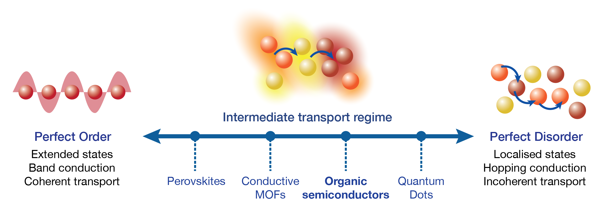

# Delocalised Kinetic Monte Carlo (dKMC):
dKMC is a package for simulating fundamental transport processes involving partially delocalised carriers in disordered materials, including charge and exciton transport as well as charge separation and generation. We developed dKMC for organic semiconductors, but it can be applied to other materials as well.

## Introduction:
The movement of charge and energy is one of the most fundamental processes in materials science, underpinning technologies such as solar cells, light-emitting diodes, batteries, and electronics. Transport is well understood in both highly ordered materials (band conduction) and highly disordered ones (hopping conduction). However, in moderately disordered materials—including many organic semiconductors—transport lies in the intermediate regime between these two well understood extremes. Accurately modelling conduction in the intermediate regime is difficult because describing wavefunction delocalisation requires a fully quantum-mechanical treatment, which is challenging in disordered materials that lack periodicity. 



dKMC treats, in three dimensions, all the processes crucial in organic semiconductors: disorder, delocalisation, and polaron formation. As a result, it can treat the intermediate transport regime between band and hopping conduction. dKMC reveals that the fundamental physics of transport in moderately disordered materials is that of charges and excitons hopping between partially delocalised states. These results, and the theoretical basis for dKMC, are described in the following papers:
- [Balzer, D.; Smolders, T. J. A. M.; Blyth, D.; Hood, S. N.; Kassal, I. Delocalised Kinetic Monte Carlo for Simulating Delocalisation-Enhanced Charge and Exciton Transport in Disordered Materials. *Chemical Science* **2021**, *12*(6), 2276–2285.](https://pubs.rsc.org/en/content/articlelanding/2021/sc/d0sc04116e)
- [Balzer, D.; Kassal, I. Mechanism of Delocalization-Enhanced Exciton Transport in Disordered Organic Semiconductors. *Journal of Physical Chemisry Letters* **2023**, *14*(8), 2155-2162.](https://pubs.acs.org/doi/10.1021/acs.jpclett.2c03886)
- [Balzer, D.; Kassal, I. Even a Little Delocalisation Produces Large Kinetic Enhancements of Charge-Separation Efficiency in Organic Photovoltaics. *Science Advances* **2022**, *8*, eabl9692.](https://www.science.org/doi/10.1126/sciadv.abl9692)
- [Balzer, D.; Kassal, I. Delocalisation enables efficient charge generation in organic photovoltaics, even with little to no energetic offset. *Chemical Science* **2024**, *15*, 4779.](https://pubs.rsc.org/en/content/articlelanding/2024/sc/d3sc05409h)

## Modules:
This package contains five folders, all found within the src folder, one containing shared functions and one for the simulation of each of four fundamental transport processes: charge transport, exciton transport, charge separation, and charge generation. The charge- and exciton-transport modules can be used to simulate transport in any organic semiconductor (or other intermediate-regime material), while the charge-separation and -generation modules are specific to organic photovoltaics because they require an interface between donor and acceptor materials.

In summary:
1. The **charge transport** module calculates charge carrier mobilities.
2. The **exciton transport** module calculates exciton diffusion coefficients.
3. The **charge separation** module calculates the internal quantum efficiency of charges separating from CT states.
4. The **charge generation** module calculates the internal quantum efficiency of generating free charges from excitons.

## How to use:
Before running any simulations:
1. Install Julia from "https://julialang.org/downloads/".
2. In Julia, install the dKMC package dependencies using: 
```julia
] add https://github.com/kassalgroup/dKMC.jl
```
3. In terminal, clone the dKMC repository into a folder of your choice using:
```
git clone https://github.com/kassalgroup/dKMC.jl.git
```

Running simulations:

4. Navigate to the module you would like to run, and read the corresponding *README.md* file for specific instructions on how to run that module.

## Typical module behaviour:
Each module contains an example output file which demonstrates successful running of the module, shows the results produced by the module, and an example runtime for the simulations provided with the example input file. The example output files can therefore be used to check that the module is running normally.